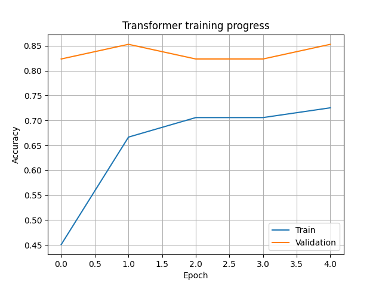
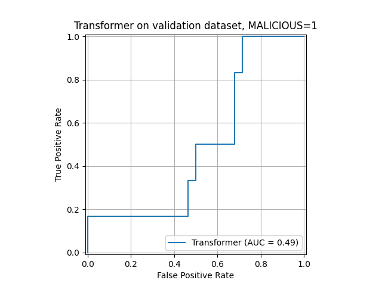

# Train a transformer from scratch, on behavior event sequences

This folder demos how to train an encoder-only transformer on sequences, from scratch, for a classification task.

For EagleEye, we train the transformer on the binary classification task. Each behavior sequence needs to have a binary label (*malicious* or *benign*).

## Run code

You can run the transformer training on the small dataset contained in this repository like so:

- Navigate to the repository root directory
- Use Python 3.12
- Create a pip virtual environment:
```
python -m venv .venv
source ./.venv/bin/activate
```
- Install required Python libraries:
```
pip install -r ./requirements.txt
```
- Run the main script:
```
python ./5-EagleEye-training/main.py
```

As part of running this script, you'll get a graphical report on the training progress, like so:



Moreover, you'll get a receiver operator characteristic (ROC) curve. This ROC curve showcases the trade-off between precision (True positive rate) and false alarms (False positive rate):



You can get more information about the dataset we just used under [4-Create-dataset/README.md](../4-Create-dataset/README.md)

## The transformer architecture

The transformer we're using is similar to BERT-Tiny. Checkout this [Huggingface page](https://huggingface.co/prajjwal1/bert-tiny) and this [paper](https://arxiv.org/abs/1908.08962) for more details.

## Bring your own data

The transformer training can be run on your own behavior dataset. Make sure to follow all prior steps for dataset creation, including:
- [2-Security-features](../2-Security-features)
- [4-Create-dataset](../4-Create-dataset)

The dataset is expected to contain the following numpy arrays:
- `x_train`: The training sequences of shape (`number of train windows`, `sequence length`, `number of features`)
- `y_train`: The training labels of shape (`number of train windows`, 2), where each label is equal to either `[0,1]` or `[1,0]`
- `x_val`: The validation dataset of shape (`number of val windows`, `sequence length`, `number of features`)
- `y_val`: The validation labels of shape (`number val of windows`, 2), where each label is equal to either `[0,1]` or `[1,0]`

## Hyper parameter tuning

The training script [5-EagleEye-training/main.py](./main.py) has several hyper parameter that you should adjust. Those include, among many:
- `EPOCHS`: The number of times you iterate through all training samples
- `ATTENTION_HEADS`: The number of attention heads for the attention mechanism
- `NUM_ENCODERS`: The encoder stack size
- `LR`: The learning rate
- `CHECKPOINT_FOLDER`: The file path to your model checkpoints
- `DATASET`: The file path to your own dataset

Generally speaking, slower training (lower learning rates) will lead to better results. Moreover, more diverse training data will lead to better
results on the validation dataset.

Note that you should use your `validation` dataset for hyper parameter tuning.
Finally, if you're really serious about your experiments, make sure to also include a `test` dataset, on which you benchmark
your best performing model.