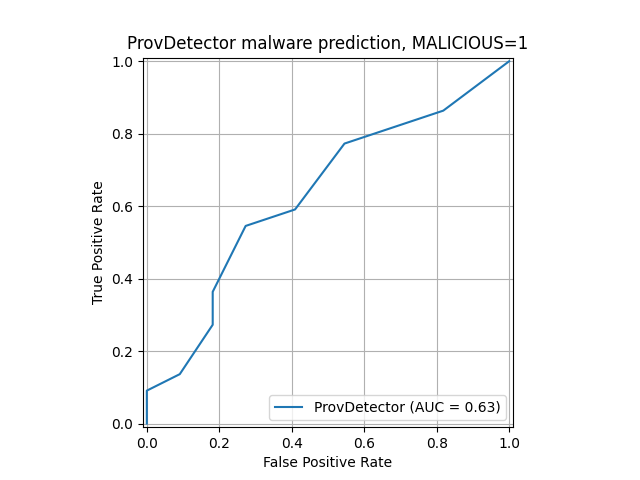

# Re-implementation of ProvDetector

This is a re-implementation of [ProvDetector](https://kangkookjee.io/wp-content/uploads/2021/06/provdetector-ndss2020.pdf)

The following projects have helped to reproduce the original ProvDetector implementation:
- [Mimicry paper repository](https://bitbucket.org/sts-lab/mimicry-provenance-generator/src/master/provDetector/)
- [Some random GitHub repository](https://github.com/nodiff-229/GAT_provdetector/blob/master/main.py)

There are two versions of ProvDetector: the original unsupervised version, and our adaption to a supervised version. In the supervised setting, both malicious and benign data is seen during the training phase, and a random forest is trained on the binary classification task of malware detection.

## Run code

You can run the ProvDetector pipeline like so:

- Navigate to the repository root directory
- Use Python 3.12
- Create a pip virtual environment:
```
python -m venv .venv
source ./.venv/bin/activate
```
- Install required Python libraries:
```
pip install -r ./requirements.txt
```
- Run the main script:
```
python ./6-ProvDetector/main.py
```

This will run both the training and testing phase. As a result, you'll see the prediction accuracy on the console, plus a ROC curve gets plotted like so:


## Pipeline overview

Graph classification with ProvDetector works as follows:

**1) Prepare behavior data in CSV file format** (See section [ProvDetector CSV data format](#provdetector-data-format))

**2) Training phase**:
* Create a frequency database. This database shows the frequency at which system entities appear in provenance graphs. Moreover, the database shows the frequency at which different system entities interact with each other.
* Compute the rarest paths in the graphs. 
* Turn all rare paths into readable, English sentences, like `process:winword.exe write file:t1.txt read_by process:outlook.exe write socket:101.22.22.1:8080`.
* Train a document embedding model on English sentences (Doc2Vec).
* Train a random forest classifier, which classifies sentence embeddings into benign and malicious.

**3) Test phase**:
* Compute rarest paths for test graphs, using the frequency database from the training data.
* Turn rare paths into English sentences.
* Compute sentence embeddings with trained Doc2Vec model.
* Run inference on the random forest, to compute a malware probability per provenance graph.

## ProvDetector data format

While this repository contains some starter data from DARPA TC 5D, you'll need to bring your own data. Make sure to transform your provenance graphs into the data format explained below.

Each provenance graph should be stored as 1 CSV file. Below you can see the expected CSV columns.

|Explanation|sourceId|sourceType|destinationId|destinationType|action|processName|timestamp|pid0|pid1|
|---|---|---|---|---|---|---|---|---|---|
|Column meaning|0: Full source name|1: Source type|2: Full destination name|3: Destination type|4: Action type|5: Name of (first) executable|6: Timestamp|7: (first) PID|8: optional, second PID|
|File read|/data/file.txt|file|/bin/proc1.exe|process|read|proc1.exe|1000|1||
|File write|/bin/proc1.exe|process|/data/file.txt|file|write|proc1.exe|1001|1||
|Socket send|/bin/proc1.exe|process|192.168.0.1|socket|read|proc1.exe|1002|1||
|Socket receive|192.168.0.1|socket|/bin/proc1.exe|process|write|proc1.exe|1003|1||
|Start new process|/bin/proc1.exe|process|/bin/proc2.exe|process|start|proc1.exe|1004|1|2|

You can also find sample CSV files under the [behavior events folder](./behavior_events/).

## Hyper-parameters

The `main.py` file contains several critical hyper-parameters. Ideally, you perform your own hyper-parameter tuning on validation data.
You can find all hyper-parameters for the DARPA 5D and REE-2023 dataset in the EagleEye paper, Appendix D. 

Below you will find an explanation of the settings:

- `TRAIN_DATA`: The CSV data used for training ProvDetector. The folder should contain a `malicious` and a `benign` subfolder.
- `TEST_DATA`: The CSV test data. Again, the folder should contain a `malicious` and a `benign` subfolder.

Below you will find an explanation of the hyper-parameters:
- `NUM_RARE_PATHS_PER_GRAPH_TRAIN`: Maximum number of rare paths per graph, for the training dataset.
- `NUM_RARE_PATHS_PER_GRAPH_TEST`: Same as `NUM_RARE_PATHS_PER_GRAPH_TRAIN`, but for the test data set.
- `SUBPATH_LENGTH_LIMIT`: On rare occasions, paths can be very long. If this happens, we break them up into chunks of this maximal length.
- `MAX_NUM_SUBPATHS_PER_GRAPH`: The maximal number of chunks per graph.
- `DOC2VEC_EPOCHS`: The number of epochs for the Doc2Vec training.
- `DOC2VEC_VECTOR_DIM`: The output dimension of the Doc2Vec model.
- `RF_N_ESTIMATORS`: The number of decision trees in the random forest.
- `RF_MAX_DEPTH`: The maximal depth per decision tree.
