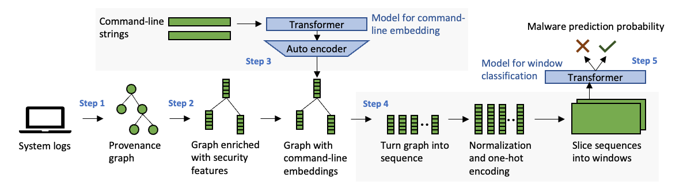
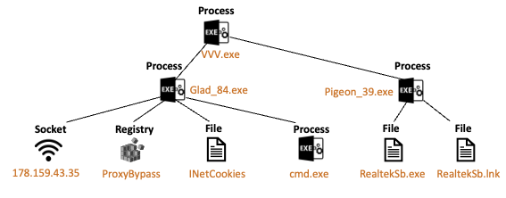
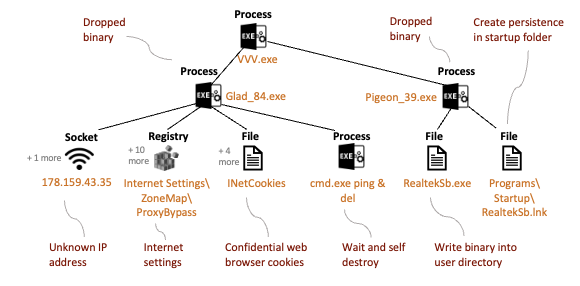
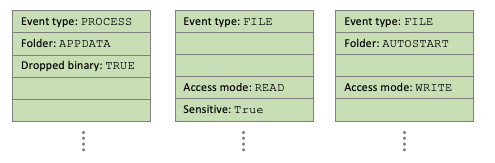
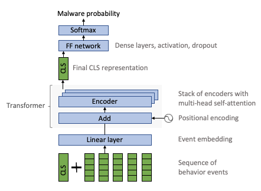

# EagleEye: Transformer-based malware detection using provenance graphs

This is the open source implementation of the [EagleEye paper](https://arxiv.org/abs/2408.09217), which was presented as a research paper at [eCrime 2024](https://apwg.org/event/ecrime2024/).



## Repository content - overview

* [Step 1: Malware dataset](./1-Malware-dataset): The malicious samples of the dataset "REE-2023", consisting of 7'000 provenance graphs.
* [Step 2: Extract security features](2-Security-features): Enrich raw provenance graphs with rich security features. Additionally, this folder contains a detailed description of all security features leveraged by EagleEye.
* [Step 3: Command-line embedding](3-Command-line-embedding): The implementation for embedding command-line strings into high-dimensional vectors. This step adds additional security features to the provenance graphs.
* [Step 4: Create dataset](4-Create-dataset): Turn the enriched provenance graphs into a dataset. This data pipeline starts with graphs generated in the previous two steps, and ends with a dataset which can be used for training of the ML model.
* [Step 5: EagleEye training](5-EagleEye-training): Train a transformer from scratch to perform malware classification. This script leverages the dataset created in the previous [step 4](4-Create-dataset).
* [Step 6: ProvDetector re-implementation](6-ProvDetector): A re-implementation of one of the malware detection baselines.

## Step 1: Dataset collection



EagleEye requires behavior data collected on endpoint devices. Typically, such behavior data can be created via an EDR (endpoint detection and response) solution. Most modern EDR solutions offer the capability of creating system logs. These logs contain all kernel-level actions taken by all processes running on the endpoint, including behavior events like file access, internet access, etc. In order to capture the relationship between different system events, the logs should be converted to process provenance graphs.

**Question**: Does this repository contain the *code* for *Step 1*?

**Anser**: No

**Question**: Does this repository contain the *result* of *Step 1*?

**Answer**: Yes and no: we do provide the malware dataset *REE-2023* from the EagleEye paper, but no the benign dataset. Each malware sample's behavior data is already converted to a provenance graph.

**Question**: Does the paper describe this step?

**Answer**: Yes, in section V.B.

## Step 2: Extract security features



When cyber security experts craft malware signature rules, they look for very specific behavior patterns. Such specific behavior can include the persistence of a binary in the Windows `Autostart` folder; an application which reads web browser cookies with potentially sensitive data - etc. We consulted with experienced security experts to define security relevant features. These features build on top of the *raw* features contained in the process provenance graph, and they provide a stronger singal to the downstream machine learning model and simplify the learning of malicious patterns.

The input of this processing step is a provance graph with *raw* features, such as file paths, process names, etc. The output is a provenance graph with *security* features.

**Question**: Does this repository contain the *code* for *Step 2*?

**Anser**: Partly yes. The repository contains a demo for security feature extraction, see [Step 2: Extract security features](2-Security-features). Note that your dataset will likely contain varying *raw* features, so you'll need to implement your own feature extraction logic.

**Question**: Does this repository contain the *result* of *Step 2*?

**Answer**: Partly yes. The repository contains a small demo provenance graph with security features. For your own research, please create a large dataset of enriched graphs.

**Question**: Does the paper describe this step?

**Answer**: Yes, in section V.C.

## Step 3: Command-line embedding

The command-line strings used to start a process contain valuable details about the intent of an application. When one tries to represent a string with handcrafted features, one will likely miss some important clues about the application intent. EagleEye uses a sentence transformer to extract the semantic meaning of command-line strings. Note that this sentence transformer is different from the transformer used in step 5. The paper shows that the features created by the sentence transformer contain a richer and more nuanced representation of the command string.

EagleEye uses a pre-trained `all_MiniLM_L6_v2` from `Huggingface` for the string embedding. To further reduce dimensionality, an auto-encoder is trained on all the command-line strings of the training dataset.

The result of this processing step are provenance graphs with security features plus command-line embeddings.

**Question**: Does this repository contain the *code* for *Step 3*?

**Anser**: Yes, see [Step 3: Command-line embedding](3-Command-line-embedding)

**Question**: Does this repository contain the *result* of *Step 3*?

**Answer**: Partly yes, we provide the trained ML models for command-line embedding.

**Question**: Does the paper describe this step?

**Answer**: Yes, in section V.D.

## Step 4: Create dataset



In this step, the provenance graphs with security features are turned into a dataset. This dataset is ready to be used for training of the transformer model. There are a number of processing steps invovled here. First of all, all behavior events in the provenance graph need to be turned into a linear sequence of events. Second, each event should be represented by its *security feature vector*, which contains numerical, categorical and boolean features. Third, all categorical data needs to be one-hot encoded. Forth, all numerical features need to be normalized. And fifth, the long sequences need to be broken down into fixed-sized windows. This enables training in mini-baches.

The end result is a large numpy array with the following dimensions: (`S`: number of sequences, `W`: window size, `F`: feature dimension). Each individual sequence will be one training point. Each sequence consists of `W` behavior events. And each behavior event is represented by a vector of `F` dimensions.

**Question**: Does this repository contain the *code* for *Step 4*?

**Anser**: Yes, see [Step 4: Create dataset](4-Create-dataset)

**Question**: Does this repository contain the *result* of *Step 4*?

**Answer**: Partly yes. The repository contains a small dataset of benign and malicious data. For your own research, please create a larger dataset.

**Question**: Does the paper describe this step?

**Answer**: Yes, in section V.E.

## Step 5: EagleEye training



In the EagleEye paper, we train a transformer model from scratch, on the process behavior dataset. The goal of the transformer is to predict whether a sequence of behavior events belongs to a *benign* or *malicious* computer application. We implemented the training in *TensorFlow*, in only ~200 lines of code. 

The transformer has an encoder-only architecture and is similar to a *BERT-Tiny* model. Each behavior event sequence is prepended by a special `CLS` token. The events are fed into an embedding layer, which reduces the dimensionality of the events. Next, a positional encoding is added to each event. Each event token is then passed through an encoder stack, which contains multi-head self-attention. The final representation of the special `CLS` token is passed through a 2-layer neural network, and finally we have a softmax function.

**Question**: Does this repository contain the *code* for *Step 5*?

**Anser**: Yes. You can run the training script under [Step 5: EagleEye training](./5-EagleEye-training). Moreover, you can use a [small dataset](./4-Create-dataset/dataset.npz) available in this repository.

**Question**: Does this repository contain the *result* of *Step 5*?

**Answer**: No. The trained transformer is always specific to your dataset.

**Question**: Does the paper describe this step?

**Answer**: Yes, in section IV.

## Cite this work

We hope this open source implementation of EagleEye brings new ideas and opportunities to the security research community. You can feed your own behavior dataset into the provided data processing pipeline, and train your own Transformer model. If you find this research useful, please consider referencing our work:

```
@inproceedings{gysel2024eagleeye,
  title={EagleEye: Attention to Unveil Malicious Event Sequences from Provenance Graphs},
  author={Gysel, Philipp and W{\"u}est, Candid and Nwafor, Kenneth and Ja{\v{s}}ek, Otakar and Ustyuzhanin, Andrey and Divakaran, Dinil Mon},
  booktitle={2024 APWG Symposium on Electronic Crime Research (eCrime)},
  pages={27--42},
  year={2024},
  organization={IEEE}
}
```

## Presentation at the eCrime symposium

We presented our research paper at eCrime 2024. You can find our presentation slide deck on [Google Drive](https://docs.google.com/presentation/d/1A4wdJlc1zMCmHiyUBqyCNDpH2EckyLpG/edit?usp=sharing&ouid=103946408468324257180&rtpof=true&sd=true).
